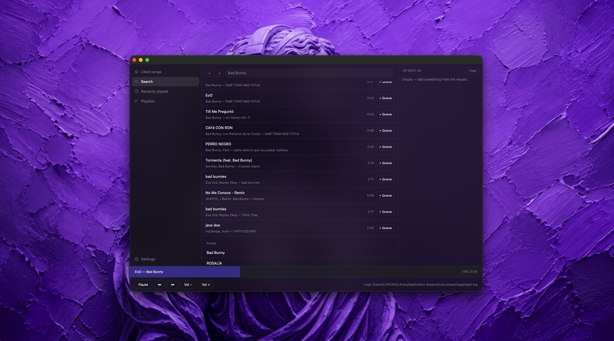

# Rust Player

A small native macOS music player written in Rust. It browses Spotify, plays
audio locally, and keeps the player window focused on the essentials: search,
queue, and transport controls. No Spotify desktop client or terminal is needed
to listen.

## What it does

- Signs in through Spotify in the browser and restores the session on later launches.
- Searches Spotify's catalog and lets you play or queue results.
- Provides native playback, progress, previous/next, pause/resume, and volume controls.
- Keeps playback running when the window closes; reopen it from the dock.
- Runs against a scripted fake runtime for UI work without credentials or audio hardware.

## Project layout

- `apps/player` — the native GPUI application.
- `crates/player-core` — source-neutral commands, snapshots, runtime contract, and fake runtime.
- `crates/player-spotatui` — adapter from that contract to the embedded playback engine.
- `docs/` — implementation decisions, smoke test, and supporting research.

## Requirements

Rust and the macOS build tools are required. For native playback, install
PortAudio and `pkgconf`:

```sh
brew install pkgconf portaudio
```

## Run

Start the app with a deterministic, credential-free runtime:

```sh
cargo run -- --fake
```

Or launch the Spotify-backed player:

```sh
cargo run
```

The first real launch opens the browser for Spotify sign-in. Native streaming
requires a Spotify Premium account.

## Development checks

```sh
cargo fmt --check
cargo check
cargo test
```

## Package for macOS

Build an unsigned, self-contained app bundle with PortAudio included:

```sh
scripts/package_app.sh
open "target/pkg/Rust Player.app" --args --fake
```

See [the manual smoke test](docs/SMOKE_TEST.md) before shipping a release.

## More context

[Implementation plan](docs/IMPLEMENTATION_PLAN.md) documents the product and
architecture decisions. [CONTEXT.md](CONTEXT.md) defines the project's domain
language.
